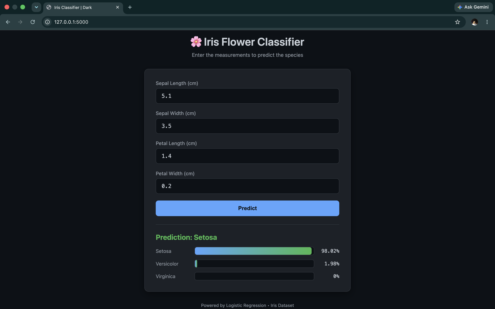
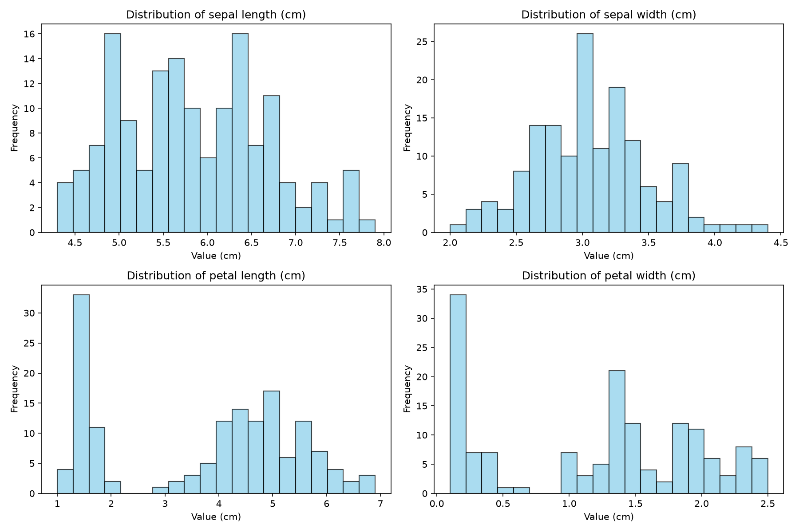
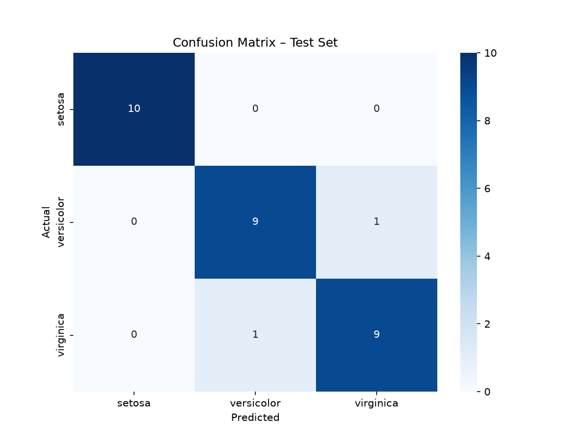
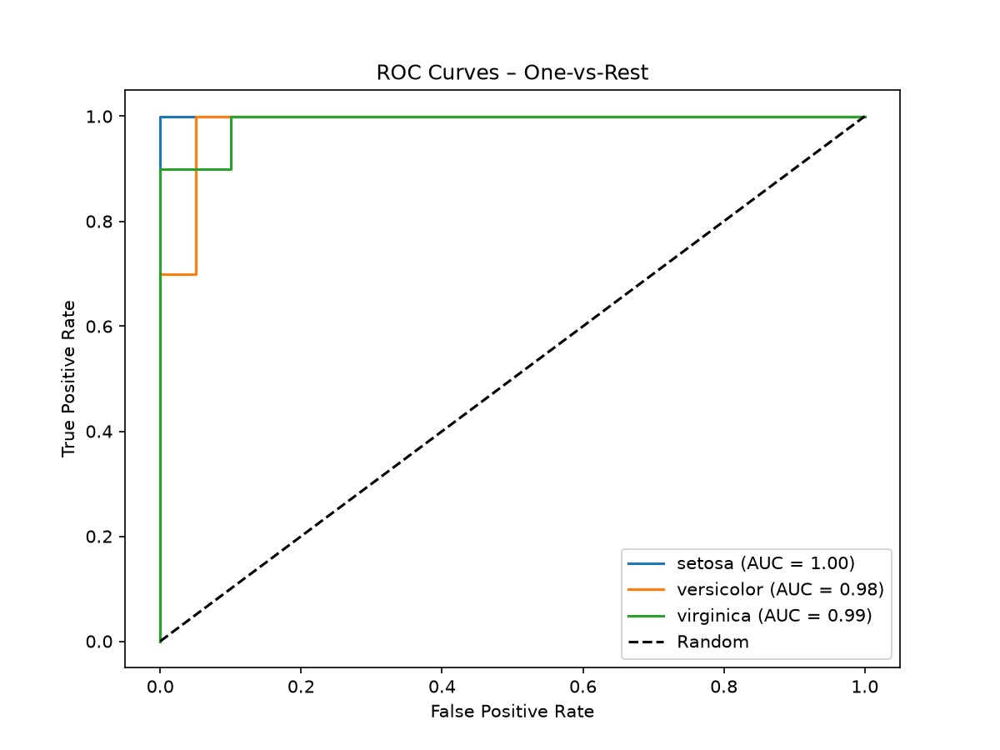

# Iris Flower Classification

A complete end‑to‑end machine learning project that classifies Iris flowers into three species (Setosa, Versicolor, Virginica) using Logistic Regression, with extensive evaluation graphs and a dark‑themed web interface for real‑time predictions.

## Features

- Automated data loading and preprocessing
- Model training with cross‑validation
- 6+ evaluation graphs saved to `reports/figures/`
- Dark‑coded web UI for predictions (Flask + HTML/CSS/JS)
- Modular, production‑ready code structure

## Quick Start

1. Clone the repo
2. Create virtual environment: `python3 -m venv .venv`
3. Activate: `source .venv/bin/activate`
4. Install deps: `pip install -r requirements.txt`
5. Train: `python src/models/train_model.py`
6. Run web app: `python web/app.py`
7. Open `http://127.0.0.1:5000`

## Project Structure

iris-classification/
├── .gitignore
├── LICENSE
├── README.md
├── CONTRIBUTING.md
├── accuracy.txt
├── requirements.txt
├── data/
│ ├── raw/
│ └── processed/
├── models/
├── reports/
│ └── figures/
├── src/
│ ├── **init**.py
│ ├── data/
│ │ └── make_dataset.py
│ ├── features/
│ │ └── build_features.py
│ ├── models/
│ │ ├── train_model.py
│ │ └── predict_model.py
│ └── visualization/
│ └── visualize.py
└── web/
├── app.py
├── templates/
│ └── index.html
└── static/
├── css/
│ └── style.css
└── js/
└── script.js

## Results

- Test Accuracy: **~96–100%** (see `accuracy.txt`)
- All graphs in `reports/figures/`

## 📊 Evaluation Graphs

### Feature Distributions

### Confusion Matrix

### ROC Curves

## License

MIT
